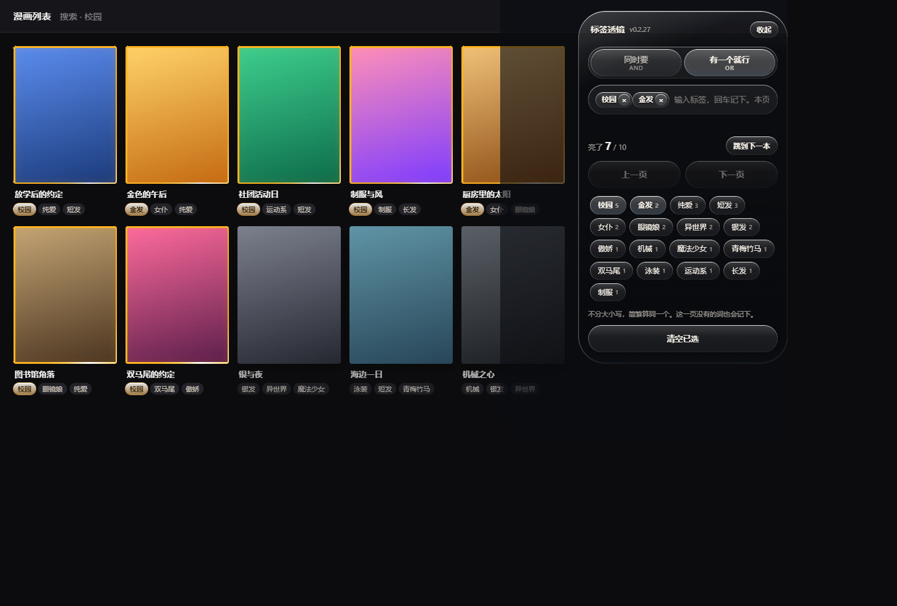
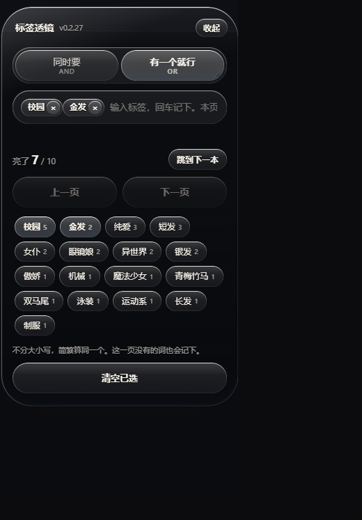

  

# 漫画标签透镜

禁漫天堂（[jmcomic](https://jmcomic.me)）用的油猴脚本。打开禁漫的列表或搜索页，打上要找的标签，对上的漫画当场亮起来。

**当前只适配禁漫。** 禁漫天堂、`jmcomic.me`、`jmcomic1.me` 这类地址，以及同一套站的 `18comic` 会出透镜。别的网站不会出现。

---

## 安装

1. 浏览器先装 [Tampermonkey](https://www.tampermonkey.net/)（篡改猴）。
2. 再点下面这个链接，油猴会弹出安装窗口。

**[点击安装脚本](https://cdn.jsdelivr.net/gh/toocutetop/manga-tag-lens@main/src/manga-tag-lens.user.js)**

https://cdn.jsdelivr.net/gh/toocutetop/manga-tag-lens@main/src/manga-tag-lens.user.js

装过旧版的，在油猴里打开这个脚本，点「检查更新」。

---

## 长什么样

下面两张是演示页，用来看面板和高亮。真正打开禁漫时，封面还是网站自己的图。

在列表页记下标签后，对上的封面会走一圈金边，右边是透镜：

面板可以拖走，位置会记住。页面是黑底时，字会自动换成浅色：

---

## 它做什么

| 现在 | 装上之后 |
|---|---|
| 在禁漫里按标签找，要点一次跳一页 | 就在当前列表打标签，对上的当场亮出来 |
| `无修正` 和 `無修正`、`NTR` 和 `ntr` 各算一个 | 简繁、大小写算同一个 |
| 一次只能看一个标签 | 可以加多个，选「同时要」或「有一个就行」 |

这一页还没有的词也能记下，翻到下一页继续对。

---

## 怎么用

1. 装好脚本，打开 **禁漫天堂** 的分类、搜索或列表页。
2. 右上角出现透镜。输入标签回车，或点下面现成的词。
3. 对上的漫画会亮起来，并排到自己那一排最前面。封面大小和网站原来的一样。

| 操作 | 效果 |
|---|---|
| 输入后回车，或点下面的词 | 记下这个标签。这一页没有的词也能加 |
| **同时要 / 有一个就行** | 同时要＝每本都得带上全部已选；有一个就行＝带上任意一个就亮 |
| **点顶部整条** | 展开或收起。按住可以拖动，松手后位置会记住 |
| **跳到下一本** | 滚到下一部亮着的漫画 |
| **上一页 / 下一页** | 翻禁漫自己的列表页，已选标签还在 |
| **清空已选** | 去掉已选标签和高亮，页面回到原样 |

对上的封面有金色边。正在看的那本换成冷色。没对上的会变淡。

---

## 常见问题

**别的漫画站怎么不出透镜？**  
当前只适配禁漫（jmcomic）。别的网站不会出现，这是故意的。

**我在禁漫，面板还是没出来？**  
先看油猴里这个脚本开了没有。首页最上面那排轮播没有标签，那里不会亮。

**高亮关不掉？**  
点「清空已选」，或从油猴菜单点「清除高亮」。刷新页面也会回到原样。

**简体繁体没算成同一个？**  
安装时要能上网。下完之后在油猴里再保存一次脚本。

**记下的标签会传到网上吗？**  
不会。只存在你自己的浏览器里。
